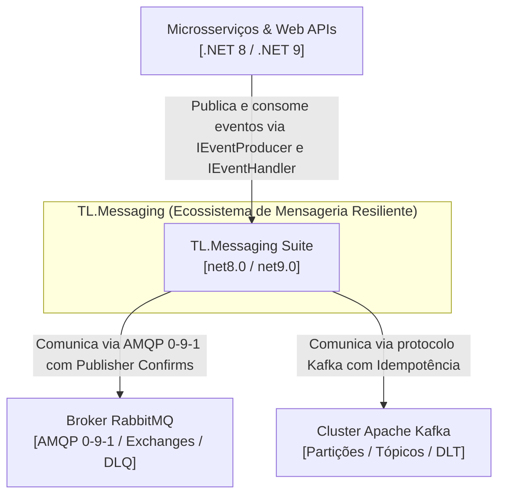

# Visão Geral da Arquitetura — TL.Messaging

## 📋 1. Resumo Executivo

O **TL.Messaging** é o ecossistema corporativo de mensageria assíncrona resiliente para aplicações .NET modernas (com suporte nativo a `.NET 8.0 LTS` e `.NET 9.0 STS`), desenhado sob o padrão arquitetural **Ports & Adapters (Hexagonal Architecture)**.

O repositório fornece uma abstração unificada e desacoplada para sistemas orientados a eventos (Event-Driven Architecture), permitindo que a camada de domínio e aplicação interaja com mensageria sem conhecer detalhes de baixo nível dos brokers físicos (**RabbitMQ** ou **Apache Kafka**).

A suíte é composta por:
1. **`TL.BaseContracts`**: Fundação corporativa de portas agnósticas universais (`IEventProducer`, `IEventHandler<T>`), envelope `EventMessage<T>` compatível com CloudEvents v1.0, metadados contextuais (`EventMetadata`) e envelope funcional (`Result`, `Error`). **Zero dependências externas**, consumido via NuGet oficial.
2. **`TL.Messaging.RabbitMQ`**: Adaptador AMQP 0-9-1 com suporte a Publisher Confirms, topologia automática idempotente de Exchanges, Filas e Dead-Letter Queue (`.dlq`), e retentativas exponenciais com Polly.
3. **`TL.Messaging.Kafka`**: Adaptador Apache Kafka com controle de partição por chave, idempotência nativa (`Acks.All`), commit manual de offsets e redirecionamento para Dead-Letter Topic (`.dlt`).
4. **`TL.Messaging.Showcase.Api`**: Aplicação de vitrine técnica (Minimal API em .NET 8/.NET 9 com Swagger) demonstrando publicação e consumo em ambos os brokers.

---

## 🏛️ 2. Diagramas C4

### 2.1 Nível 1: Diagrama de Contexto de Sistema (C4 Context)



### 2.2 Nível 2: Diagrama de Containers / Componentes (C4 Container - Ports & Adapters)

```mermaid
graph TD
    subgraph "Camada de Domínio / Aplicação"
        AppHost["Host Application<br/>(ASP.NET Core Web API / Worker Service)"]
        Handler["Manipulador de Negócio<br/>(IEventHandler&lt;TOrder&gt;)"]
    end

    subgraph "TL.BaseContracts (Fundação de Contratos NuGet)"
        ProducerPort["IEventProducer<br/>(PublishAsync, PublishBatchAsync)"]
        HandlerPort["IEventHandler&lt;T&gt;<br/>(HandleAsync)"]
        Envelope["EventMessage&lt;T&gt;<br/>(EventId, CorrelationId, Timestamp, Payload)"]
        ResultModel["Result / Error<br/>(Semântica de Retorno ACK/NACK)"]
    end

    subgraph "TL.Messaging.RabbitMQ (Adaptador AMQP)"
        RabbitProducer["RabbitMqProducer<br/>(Publisher Confirms)"]
        RabbitConsumer["RabbitMqConsumer&lt;T, H&gt;<br/>(BackgroundService + DLQ + Polly)"]
    end

    subgraph "TL.Messaging.Kafka (Adaptador Streaming)"
        KafkaProd["KafkaProducer<br/>(Acks.All + PartitionKey)"]
        KafkaCons["KafkaConsumer&lt;T, H&gt;<br/>(BackgroundService + Commit Manual + DLT)"]
    end

    AppHost --> ProducerPort
    AppHost --> Handler
    Handler -.-> HandlerPort

    ProducerPort <|.. RabbitProducer
    ProducerPort <|.. KafkaProd

    HandlerPort <.. RabbitConsumer
    HandlerPort <.. KafkaCons
```

---

## ⚖️ 3. Guia de Escolha e Comparativo Técnico

| Critério | `TL.Messaging.RabbitMQ` | `TL.Messaging.Kafka` |
| :--- | :--- | :--- |
| **Protocolo** | AMQP 0-9-1 | TCP Binário (Kafka Protocol) |
| **Caso de Uso Primário** | Comandos assíncronos, filas de trabalho, roteamento flexível | Streaming de eventos, alta vazão, retenção temporal, replay |
| **Mecanismo de Resiliência** | Dead-Letter Exchange/Queue (`.dlx` / `.dlq`) | Dead-Letter Topic (`.dlt`) |
| **Confirmação de Publicação** | Publisher Confirms (`ConfirmSelect`) | Idempotência nativa (`EnableIdempotence=true`, `Acks=All`) |
| **Ordenação** | Garantida por fila individual | Garantida por partição (via `EventMetadata.WithKafkaPartitionKey`) |
| **Gestão de Retentativa** | Polly (backoff exponencial) antes de NACK | Polly (backoff exponencial) antes de desvio para DLT |
| **Dependência Principal** | `RabbitMQ.Client` + `Polly` | `Confluent.Kafka` + `Polly` |

---

## 🗺️ 4. Mapa de ADRs do Repositório

| ADR | Projeto | Foco Arquitetural |
| :--- | :--- | :--- |
| [**`ADR-000`**](../adr/ADR-000-arquitetura-mensageria-resiliente-e-governanca.md) | `TL.Messaging` (Geral) | Visão Geral, Ports & Adapters com `TL.BaseContracts`, Governança CPM e Resiliência. |
| [**`ADR-001`**](../adr/ADR-001-tl-rabbitmq.md) | `TL.Messaging.RabbitMQ` | Adaptador AMQP, Publisher Confirms, Topologia Automática e DLQ. |
| [**`ADR-002`**](../adr/ADR-002-tl-kafka.md) | `TL.Messaging.Kafka` | Adaptador Kafka, Partition Keys, Idempotência e Dead-Letter Topic. |
